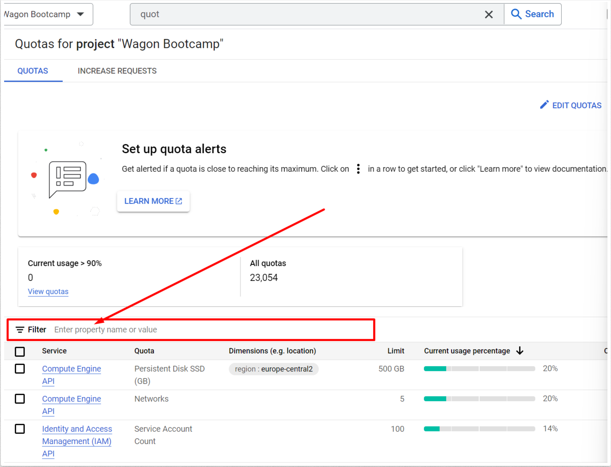
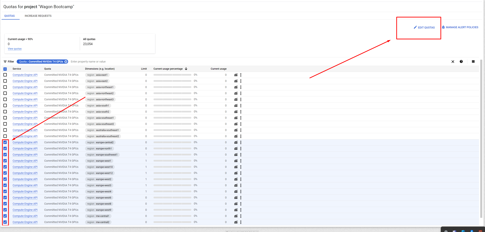
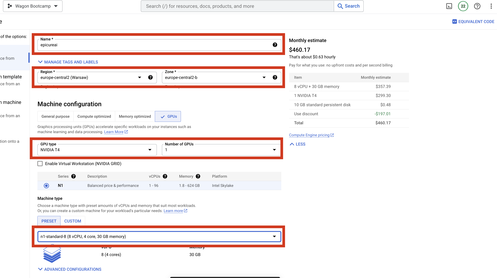
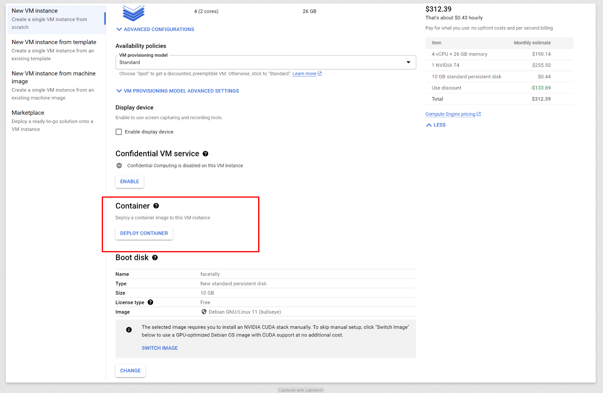
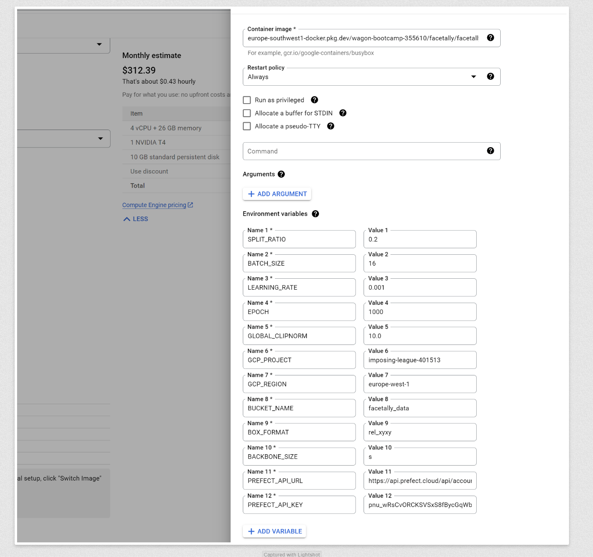
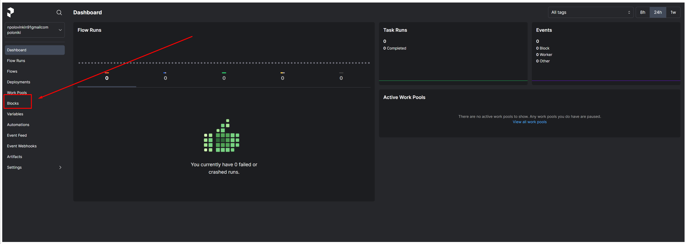
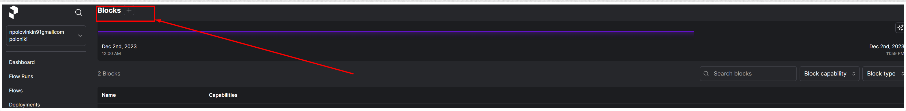
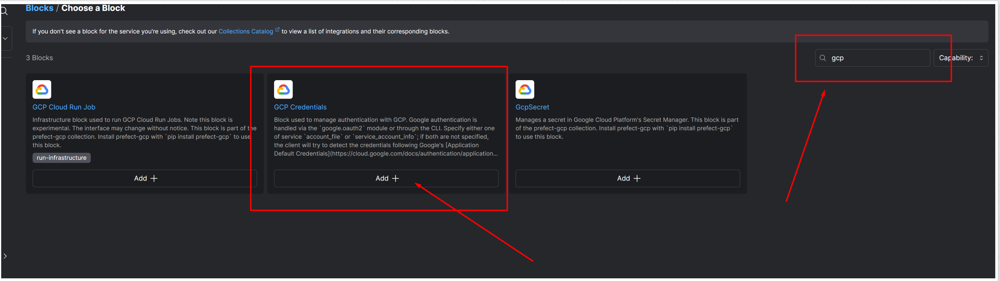

# README: Setting Up a GPU-Enabled Docker Environment for Machine Learning

This README provides a step-by-step guide to setting up a GPU-enabled environment in Google Cloud, building a Docker container for machine learning purposes, and deploying it.

## Table of Contents

1. [Requesting GPU Quota from Google Cloud](#requesting-gpu-quota-from-google-cloud)
2. [Creating a Dockerfile for Training](#creating-a-dockerfile-for-training)
3. [Securely Passing Credentials to a Remote Docker Container](#securely-passing-credentials-to-a-remote-docker-container)
4. [Setting Up Continuous Deployment](#setting-up-continuous-deployment)
5. [Creating a Virtual Instance with GPU](#creating-a-virtual-instance-with-gpu)

## Requesting GPU Quota from Google Cloud

- Navigate to [Google Cloud Quotas Page](https://console.cloud.google.com/iam-admin/quotas).
  
- Search for "T4 GPU" and select "Commited NVIDIA T4 GPUs".
  
- Choose all European regions and click 'Edit Quotas'.
- In the request form, specify you need 1 GPU and provide a brief description of your project.

## Creating a Dockerfile for Training

- Name the Dockerfile as `Dockerfile.training`.
- We have to have two different Dockerfiles as they surve different purposes and usually prediction Dockerfile is much lighter as it only needs to run prediction function. You will find example of DockerImage in this repo.

## Setting Up Continuous Deployment

- Access [Cloud Build in Google Cloud](https://console.cloud.google.com/cloud-build). Press enable if it is not enabled yet.
- Select "repositories" and then "connect repositories"
  !(screenshots/image6.png)
- Configure the image name and other settings as needed.
- Run the build and monitor the process in the 'History' tab.

## Creating a Virtual Instance with GPU

- Go to [Google Cloud VM Instances](https://console.cloud.google.com/compute/instances).
  
- Create a new instance, ensuring to select 'Deploy Container' and enter the Docker image name.
  
- Set environmental variables as required.
  
- Choose the appropriate boot disk size and other configurations.

Remember to use the command line for similar operations if preferred. Detailed instructions are provided.

### Note

Ensure to structure and elaborate each section according to the specific steps and details of your project.

### SEPARATE QUESTION

## Securely Passing Credentials to a Remote Docker Container

- Visit [Prefect Cloud](https://app.prefect.cloud/).
  
- Navigate to 'Blocks' and choose 'Add New Block'.
  
- Search for 'GCP' and fill in the necessary details.
  
- Include `prefect_gcp` in your `requirements.txt`.
- Load credentials in your Python script as follows:

  ```python
  from prefect_gcp import GcpCredentials

  async def load_google_credentials():
      gcp_credentials = await GcpCredentials.load("facetallygcp")
      return gcp_credentials.get_credentials_from_service_account()
  ```
