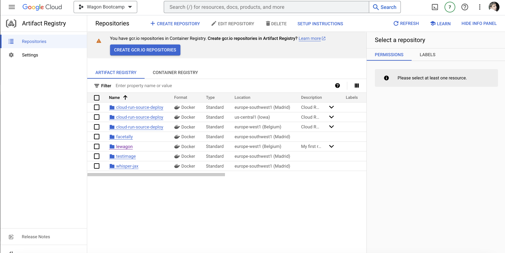
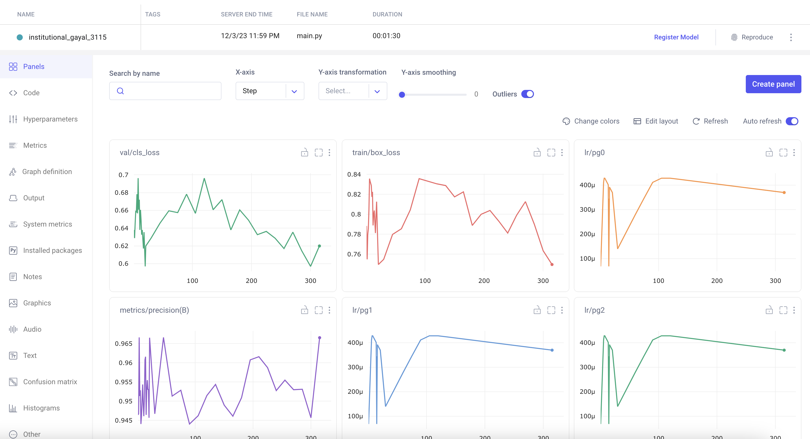

# README: Setting Up a GPU-Enabled Docker Environment for Machine Learning

This README provides a step-by-step guide to setting up a GPU-enabled environment in Google Cloud, building a Docker container for machine learning purposes, and deploying it.

I will also attach a [train.py](train.py) and [params.py](params.py) to this repo, where you can see, how you can Train yolo with ultralytics - Save model to production if this model is better then the ones before. Load weights from the best model from production and log all the training live.

## 🚨🚨🚨 DO NOT FORGET TO CHANGE CLOUD PROJECT NAMES/ API KEYS/ EXPERIMENT NAMES/ MODEL NAMES / etc.. 🚨🚨🚨

## Table of Contents

1. [Requesting GPU Quota from Google Cloud](#requesting-gpu-quota-from-google-cloud)
2. [Creating a Dockerfile for Training](#creating-a-dockerfile-for-training)
3. [Setting Up Continuous Deployment](#setting-up-continuous-deployment)
4. [Creating a Virtual Instance with GPU](#creating-a-virtual-instance-with-gpu)

## Requesting GPU Quota from Google Cloud

- Navigate to the [Google Cloud Quotas Page](https://console.cloud.google.com/iam-admin/quotas).
  
- Search for "T4 GPU" and select "Committed NVIDIA T4 GPUs".
  
- Choose all European regions and click 'Edit Quotas'.
- In the request form, specify you need 1 GPU and provide a brief description of your project.

## Creating a Dockerfile for Training

- Name the Dockerfile `Dockerfile.training`.
- Follow the same logic like in the example [Dockerfile.training](Dockerfile.training)
- Two different Dockerfiles are required as they serve different purposes: the training Dockerfile and the prediction Dockerfile. The latter is usually lighter as it only needs to run the prediction function. An example Dockerfile for Ultralytics is provided in this repository.

## Setting Up Continuous Deployment

Setting up Continuous Deployment ensures that every push to master automatically redeploys your image in the cloud withoud having to deal with internet speed or any local issues.

- Access the Artifact Registry - search for it in the Google Console Search panel at the top.
- You should see this page, click "Create repository" at the top.
  
- Specify your project name and region as shown.
  
- Access [Cloud Build in Google Cloud](https://console.cloud.google.com/cloud-build). Enable it if not already enabled.
- Select "repositories" then "connect repositories".
  
- Choose your repository.
  
- Configure the image name and other settings as shown (replace with your project names).
  
  Example of image name: `europe-southwest1-docker.pkg.dev/$PROJECT_ID/facetally/facetally_image:latest`
- Start the build process.
  
- Monitor the process in the 'History' tab. Click on the ID to view the entire process and any errors.
  
- Once completed, your Image will be pushed to the Artifact Registry, where all your images are stored.

## Creating a Virtual Instance with GPU

- Go to [Google Cloud VM Instances](https://console.cloud.google.com/compute/instances). Click 'Create instance' and select options as follows:
  
- Click 'Change boot disk'.
  
- Select options as shown.
  
- Wait for the green checkmark, then press 'SSH'.
  
- Accept the installation of NVIDIA drivers and wait a few minutes.
  
- Authorize Docker: `gcloud auth configure-docker europe-southwest1-docker.pkg.dev`
- Pull the Docker image: `docker pull europe-southwest1-docker.pkg.dev/wagon-bootcamp-355610/epicureai/epicureai_image:latest` ℹ️ℹ️ THIS IMAGE IS BEEING PULLED FROM THE ARTIFACT REGISTRY, WHICH GOT THERE WITH CONTINIOUS DEPLOYMENT OF GOOGLE BUILD WE SETUP ON PREVIOUS STEP ℹ️ℹ️
- Run Docker: `docker run --restart unless-stopped --shm-size=8g -d -e COMET_API_KEY=prlR2lPFdkjoiWB2n8SKwhvq0 -e EPOCHS=100 -e COMET_PROJECT_NAME=epicure -e COMET_MODEL_NAME=yolo-model -e COMET_WORKSPACE_NAME=poloniki --gpus all europe-southwest1-docker.pkg.dev/wagon-bootcamp-355610/epicureai/epicureai_image:latest`

  "-d" means detach = you can close terminal and it will still run
  --restart unless-stopped = docker will restart if it is stopped unless you stop it
  Make sure to specify `--shm-size=8g` and `--gpus all` to enable GPU and increase shared memory.
  Replace all project names,api keys, model names and etc, with your own!

🚀 Model will be trained in cloud and restart the image if smth breaks, also update the image whenever we will make any changes. Each new train will load best weights so far.
Monitor live training progress with Comet! 💫


### SEPARATE QUESTION

## Securely Passing Google Cloud Credentials to a Remote Docker Container

- Open [Prefect Cloud](https://app.prefect.cloud/).
  
- Navigate to 'Blocks' and choose 'Add New Block'.
  
- Search for 'GCP' and fill in the necessary details.
  
- Include `prefect_gcp` in your `requirements.txt`.
- Load credentials in your Python script as follows:

  ```python
  from prefect_gcp import GcpCredentials
  from google.cloud import storage

  async def load_google_credentials():
      gcp_credentials = await GcpCredentials.load("facetallygcp")
      return gcp_credentials.get_credentials_from_service_account()

  async def create_google_cloud():
    credentials = await load_google_credentials()
    client = storage.client(credentials=credentials)
    return client
  ```

  thats it - only complications, you will have to wrap all function syntax in async await like in the example above.
